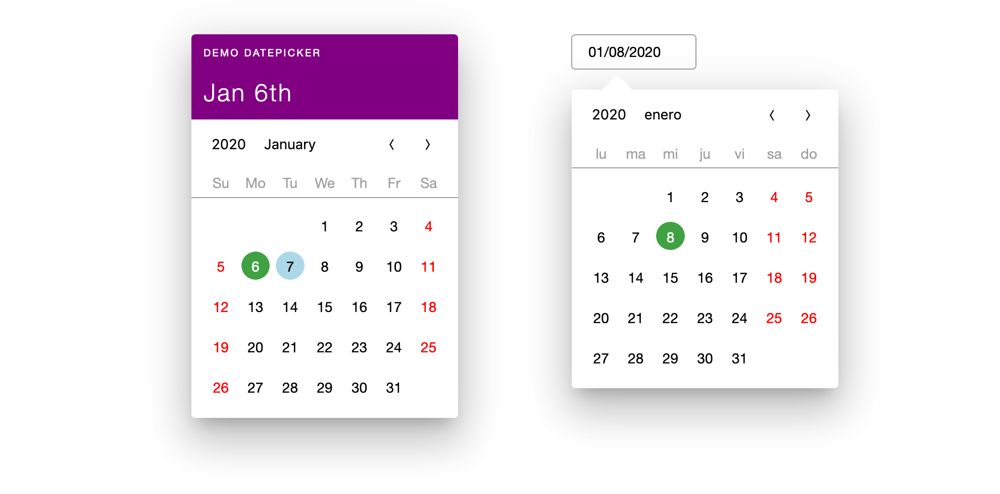

[](https://travis-ci.com/morewings/react-calendar-toolkit)
[](https://codecov.io/gh/morewings/react-calendar-toolkit)
[](https://www.npmjs.com/package/react-calendar-toolkit)
[](http://npm-stats.org/#/react-calendar-toolkit)
[](https://github.com/morewings/react-calendar-toolkit/blob/master/types/index.d.ts)
[](https://bundlephobia.com/result?p=react-calendar-toolkit)


# React calendar toolkit

[](#)

## Description
`react-calendar-toolkit` (RCT) is a set of React Components capable of rendering various calendars, datepickers etc.

[Documentation](https://react-calendar-toolkit.netlify.com)

[Demo](https://morewings.github.io/react-calendar-toolkit/)


### Motivation
There are many good datepickers on the market. Unfortunately, most of them are _style-opinionated_, so if you like logic of chosen datepicker, you are subscribing to the visual style of it. But your website or application style may be completely different. With RCT you don't have hack third-party CSS, you can write your own styled UI components and RCT will render them.

### Features
- Use your **custom UI components** to change look and feel to match your visual style.
- Has **default theme** in Material Design style.
- Uses `date-fns` as logic provider.
- Supports **localization** for 69 languages, using `date-fns` locales. You can create custom one.
- Lightweight: adds just **~10kb** to your bundle.
- **Typescript** friendly, type definitions included.
- Disable any date: 
    ```js
    disableDate: ({isWeekend, precision, date}) => Boolean
    ```
- Highlight any date:
    ```js
    highlightDate: ({isWeekend, precision, date}) => Boolean
    ```  
- Highlight weekends:
    ```js
    highlightWeekends: Boolean
    ```

## Browsers support

| [](http://godban.github.io/browsers-support-badges/)<br/>IE / Edge | [](http://godban.github.io/browsers-support-badges/)<br/>Firefox | [](http://godban.github.io/browsers-support-badges/)<br/>Chrome | [](http://godban.github.io/browsers-support-badges/)<br/>Safari | [](http://godban.github.io/browsers-support-badges/)<br/>iOS Safari |
| --------- | --------- | --------- | --------- | --------- |
| IE11*, Edge| last 2 versions, ESR| last 2 versions| last 2 versions| last 2 versions

/* needs polyfills, [see docs](https://react-calendar-toolkit.netlify.com/#/IE11%20support)

## Quickstart

 ```shell script
yarn add react-calendar-toolkit date-fns@2
```

Then use it like this:

```js
import React from 'react';
import DatePicker from 'react-calendar-toolkit'; // datepicker component
import 'react-calendar-toolkit/lib/style/default.css'; // styles

const Component = () => (
  <div>
    <DatePicker onDateSet={date => {console.log('date set', date)}} />
  </div>
);

export default Component;
``` 

## Development

### Available scripts

- `start` - starts application in development mode;
- `start:docs` - starts `Docz`;
- `build:docs` - builds `Docz`;
- `build:lib` - builds package;
- `lint:js` - runs eslint;
- `fix:js` - runs eslint with fix option enabled;
- `test` - runs tests.
- `lint:style`: runs stylelint;
- `fix:style`: runs stylelint with fix option enabled.


